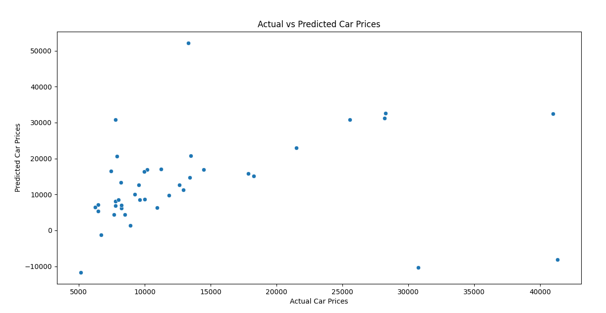
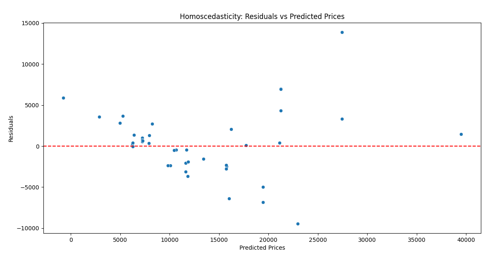

# Implementation-of-Linear-Regression-for-Predicting-Car-Prices
## AIM:
To write a program to predict car prices using a linear regression model and test the assumptions for linear regression.

## Equipments Required:
1. Hardware – PCs
2. Anaconda – Python 3.7 Installation / Jupyter notebook

## Algorithm
#### 1. Import Libraries: 
* Import necessary libraries such as pandas, numpy, matplotlib, and sklearn.
#### 2. Load Dataset: 
* Load the dataset containing car prices and relevant features.
#### 3. Data Preprocessing: 
* Handle missing values and perform feature selection if necessary.
#### 4. Split Data: 
* Split the dataset into training and testing sets.
#### 5. Train Model: 
* Create a linear regression model and fit it to the training data.
#### 6. Make Predictions: 
* Use the model to make predictions on the test set.
#### 7. Evaluate Model: 
* Assess model performance using metrics like R² score, Mean Absolute Error (MAE), etc.
#### 8. Check Assumptions: 
* Plot residuals to check for homoscedasticity, normality, and linearity.
#### 9. Output Results: 
* Display the predictions and evaluation metrics.
## Program:
```
/*
 Program to implement linear regression model for predicting car prices and test assumptions.
Developed by: Vishwaraj G. 
RegisterNumber: 212223220125
*/
# Import necessary libraries
import pandas as pd
import numpy as np
import statsmodels.api as sm
import seaborn as sns
import matplotlib.pyplot as plt
from sklearn.linear_model import LinearRegression
from sklearn.model_selection import train_test_split
from sklearn.metrics import mean_squared_error, r2_score

# Step 1: Data Loading
url = 'https://cf-courses-data.s3.us.cloud-object-storage.appdomain.cloud/IBM-ML240EN-SkillsNetwork/labs/data/CarPrice_Assignment.csv'
data = pd.read_csv(url)

# Step 2: Data Exploration and Preprocessing
# Display the first few rows of the dataset
print(data.head())

# Checking for missing values
print(data.isnull().sum())

# Dropping rows with missing values (if any)
data = data.dropna()

# Encode categorical variables (like car company names, fuel type, etc.) using one-hot encoding
data_encoded = pd.get_dummies(data, drop_first=True)

# Step 3: Splitting the data into features (X) and target (y)
X = data_encoded.drop('price', axis=1)  # Features
y = data_encoded['price']  # Target variable

# Step 4: Splitting the data into training and test sets
X_train, X_test, y_train, y_test = train_test_split(X, y, test_size=0.2, random_state=42)

# Step 5: Fitting the Linear Regression Model
model = LinearRegression()
model.fit(X_train, y_train)

# Step 6: Predicting the prices using the test set
y_pred = model.predict(X_test)

# Step 7: Evaluating the model
# Coefficients and Intercept
print("Coefficients:", model.coef_)
print("Intercept:", model.intercept_)

# R-squared
print(f'R-squared: {r2_score(y_test, y_pred)}')

# Mean Squared Error
print(f'Mean Squared Error (MSE): {mean_squared_error(y_test, y_pred)}')

# Step 8: Assumptions Testing

# 8.1 Linearity Test: Plot actual vs predicted values
plt.figure(figsize=(8,6))
sns.scatterplot(x=y_test, y=y_pred)
plt.xlabel("Actual Car Prices")
plt.ylabel("Predicted Car Prices")
plt.title("Actual vs Predicted Car Prices")
plt.show()

# 8.2 Homoscedasticity Test: Residuals vs Fitted values
residuals = y_test - y_pred
plt.figure(figsize=(8,6))
sns.scatterplot(x=y_pred, y=residuals)
plt.xlabel("Fitted Values")
plt.ylabel("Residuals")
plt.title("Homoscedasticity Test: Residuals vs Fitted Values")
plt.show()
```

## Output:


 

## Result:
Thus, the program to implement a linear regression model for predicting car prices is written and verified using Python programming, along with the testing of key assumptions for linear regression.
