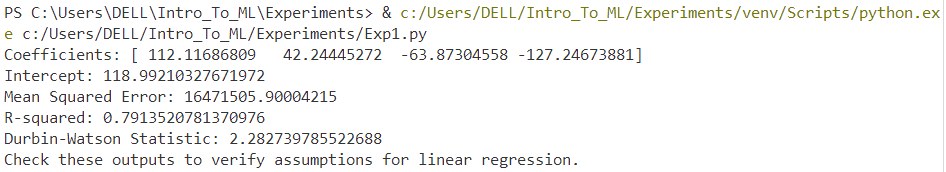
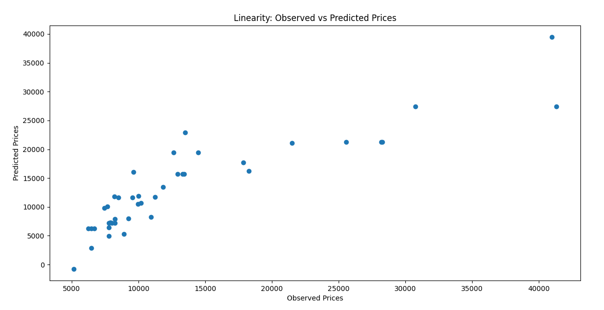
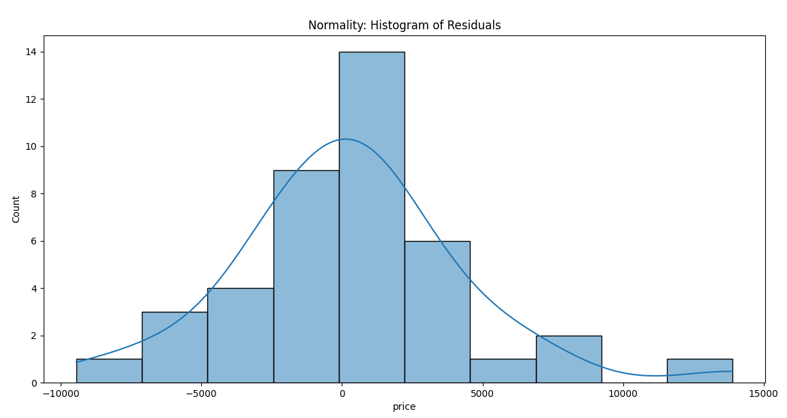
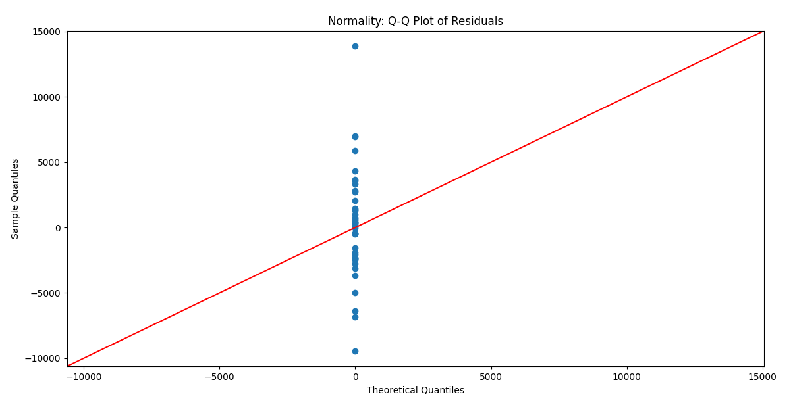

# Implementation-of-Linear-Regression-for-Predicting-Car-Prices
## AIM:
To write a program to predict car prices using a linear regression model and test the assumptions for linear regression.

## Equipments Required:
1. Hardware – PCs
2. Anaconda – Python 3.7 Installation / Jupyter notebook

## Algorithm
#### 1. Import Libraries: 
* Import necessary libraries such as pandas, numpy, matplotlib, and sklearn.
#### 2. Load Dataset: 
* Load the dataset containing car prices and relevant features.
#### 3. Data Preprocessing: 
* Handle missing values and perform feature selection if necessary.
#### 4. Split Data: 
* Split the dataset into training and testing sets.
#### 5. Train Model: 
* Create a linear regression model and fit it to the training data.
#### 6. Make Predictions: 
* Use the model to make predictions on the test set.
#### 7. Evaluate Model: 
* Assess model performance using metrics like R² score, Mean Absolute Error (MAE), etc.
#### 8. Check Assumptions: 
* Plot residuals to check for homoscedasticity, normality, and linearity.
#### 9. Output Results: 
* Display the predictions and evaluation metrics.
## Program:
```
/*
 Program to implement linear regression model for predicting car prices and test assumptions.
Developed by: Vishwaraj G. 
RegisterNumber: 212223220125
*/
import pandas as pd
import numpy as np
from sklearn.model_selection import train_test_split
from sklearn.linear_model import LinearRegression
from sklearn.metrics import mean_squared_error, r2_score
import matplotlib.pyplot as plt
import seaborn as sns
import statsmodels.api as sm

# Load the dataset
file_path = 'CarPrice.csv'
df = pd.read_csv(file_path)

# Select relevant features and target variable
X = df[['enginesize', 'horsepower', 'citympg', 'highwaympg']]  # Features
y = df['price']  # Target variable

# Split the dataset
X_train, X_test, y_train, y_test = train_test_split(X, y, test_size=0.2, random_state=42)

# Train the linear regression model
model = LinearRegression()
model.fit(X_train, y_train)

# Predictions
y_pred = model.predict(X_test)

# Model Evaluation
print("Coefficients:", model.coef_)
print("Intercept:", model.intercept_)
print("Mean Squared Error:", mean_squared_error(y_test, y_pred))
print("R-squared:", r2_score(y_test, y_pred))

# 1. Assumption: Linearity
plt.scatter(y_test, y_pred)
plt.title("Linearity: Observed vs Predicted Prices")
plt.xlabel("Observed Prices")
plt.ylabel("Predicted Prices")
plt.show()

# 2. Assumption: Independence (Durbin-Watson test)
residuals = y_test - y_pred
dw_test = sm.stats.durbin_watson(residuals)
print(f"Durbin-Watson Statistic: {dw_test}")

# 3. Assumption: Homoscedasticity
sns.scatterplot(x=y_pred, y=residuals)
plt.axhline(y=0, color='r', linestyle='--')
plt.title("Homoscedasticity: Residuals vs Predicted Prices")
plt.xlabel("Predicted Prices")
plt.ylabel("Residuals")
plt.show()

# 4. Assumption: Normality of residuals
sns.histplot(residuals, kde=True)
plt.title("Normality: Histogram of Residuals")
plt.show()

sm.qqplot(residuals, line='45')
plt.title("Normality: Q-Q Plot of Residuals")
plt.show()

# Insights
print("Check these outputs to verify assumptions for linear regression.")
```

## Output:

 


 
## Result:
Thus, the program to implement a linear regression model for predicting car prices is written and verified using Python programming, along with the testing of key assumptions for linear regression.
